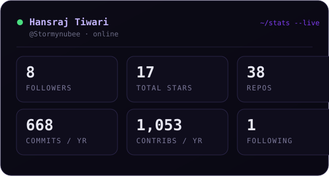

<div align="center">

<!-- ANIMATED HEADER BANNER -->


</div>

<!-- TYPING ANIMATION -->
<p align="center">

</p>

<!-- SOCIAL BADGES -->
<p align="center">
<a href="https://hansraj-dev.vercel.app/" target="_blank">

</a>&nbsp;
<a href="https://linkedin.com/in/hansraj-tiwari" target="_blank">

</a>&nbsp;
<a href="https://acezen.in/" target="_blank">

</a>&nbsp;
<a href="mailto:priyanktiwari434@gmail.com">

</a>
</p>

<!-- PROFILE VIEWS COUNTER -->
<p align="center">

</p>

<br/>

---

<!-- ABOUT ME SECTION -->

<table>
<tr>
<td valign="top" width="55%">

### hi, I'm Hansraj. I build things. 👋

```yaml
name: Hansraj Tiwari
alias: Stormynubee
age: 17 # yes, really
location: India

what I do:
- run AceZen Studio (because I hate free time)
- build full-stack apps, AI stuff, IoT things
- go to hackathons and actually ship
- grab a soldering iron when code isn't enough

started: age 8
quitting: not on the roadmap

currently:
- building something I probably shouldn't
- managing 110k+ people in tech communities
- answering emails from last week
```

</td>
<td valign="top" width="45%" align="center">
<br/>

</td>
</tr>
</table>

<br/>

---

<!-- ACHIEVEMENTS -->

## 🏆 things that actually happened

<table>
<tr>
<td>🛡️</td>
<td><b>SIH 2025 Finalist</b> &nbsp; Smart India Hackathon. made it to the finals. not bad for a teenager.</td>
</tr>
<tr>
<td>🏛️</td>
<td><b>IIT Madras RoadSoS 2026</b> &nbsp; built Margi for MoRTH's emergency response challenge. from scratch. in a hackathon.</td>
</tr>
<tr>
<td>🧬</td>
<td><b>National Children's Science Congress</b> &nbsp; represented nationally. twice. apparently once wasn't enough.</td>
</tr>
<tr>
<td>🥇</td>
<td><b>1st place</b> &nbsp; RSBVP Nationals for state-level innovation. gold, not participation.</td>
</tr>
<tr>
<td>🎓</td>
<td><b>Harvard CS50x</b> &nbsp; finished the whole curriculum. David Malan would be proud.</td>
</tr>
<tr>
<td>🌍</td>
<td><b>110k+ community</b> &nbsp; somehow people listen to me. I run design and tech communities.</td>
</tr>
<tr>
<td>🏢</td>
<td><b>AceZen Studio</b> &nbsp; founded it, still running it, not planning to stop. <a href="https://acezen.in/">acezen.in</a></td>
</tr>
</table>

<br/>

---

<!-- TECH STACK -->

## 🛠️ the stack (it's a lot, I know)

<p align="center">
<br/>
<br/>
<br/>
<br/>

</p>

<br/>

---

<!-- PROJECTS -->

## 🚀 shipped

<table>
<tr>
<td width="50%" valign="top">
<h3>🚨 Margi &nbsp; <sub>offline emergency response app</sub></h3>
<sub>


</sub>
<br/><br/>
Emergency response app that works with zero internet. handles crash triage, voice routing, QR-based bystander handoffs. built this for IIT Madras RoadSoS 2026 and yes, it actually works.
<br/><br/>
<a href="">

</a>
</td>
<td width="50%" valign="top">
<h3>🚂 Bogieflow &nbsp; <sub>real-time rail monitoring</sub></h3>
<sub>


</sub>
<br/><br/>
Rail car monitoring using IoT sensors piped into a real-time dashboard. making trains slightly less of a mystery.
<br/><br/>
<a href="https://github.com/Stormynubee">

</a>
</td>
</tr>
</table>

<br/>

---

<!-- GITHUB STATS -->

## 📊 the numbers (judge away)

<!-- custom live card — rendered + committed by .github/workflows/stats.yml, no host -->
<div align="center">

</div>

<br/>

<div align="center">


</div>

<br/>

<!-- ACTIVITY GRAPH -->
<div align="center">

</div>

<br/>

---

<!-- SNAKE CONTRIBUTION ANIMATION -->

## 🐍 a snake eating my contributions (very normal)

<div align="center">
<picture>
<source media="(prefers-color-scheme: dark)" srcset="https://raw.githubusercontent.com/Stormynubee/Stormynubee/output/github-contribution-grid-snake-dark.svg" />
<source media="(prefers-color-scheme: light)" srcset="https://raw.githubusercontent.com/Stormynubee/Stormynubee/output/github-contribution-grid-snake.svg" />

</picture>
</div>

<br/>

---

<!-- FOOTER WAVE -->


<p align="center">
<i>⚡ if it compiles, ship it. &nbsp; if it doesn't, also ship it.</i>
</p>
