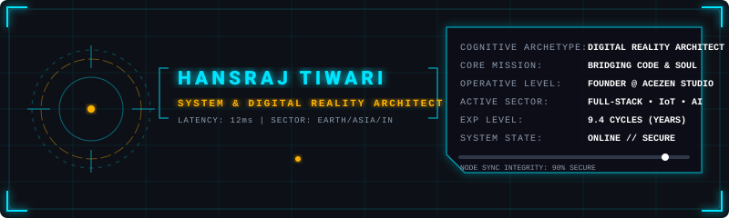

  

  
  
  

---

## ⚡ The Architectural Journey
**Multidisciplinary developer and builder since age 8.** Bridging complex high-performance software, native cybernetics interfaces, and creative cinematic design. Exploring the intersection between logic and the human soul.

> [!NOTE]
> ### 🏆 Key Accolades & Accolades
> * 🥇 **IEEE Young Engineer Excellence Award (2025)** @ IIIT Bangalore.
> * 🛡️ **Smart India Hackathon (SIH 2025) Finalist** in Advanced Engineering.
> * 🧬 **2x National Children's Science Congress (NCSC)** National Participant.
> * 🏅 **RSBVP 1st Place (Nationals)** representing state-level innovation.
> * 🏢 **Founder & Creative Director of AceZen Studio** — a cinematic digital agency.
> * 🌍 **Managed 110k+ Member Online Communities** across design and tech spaces.
> * 🎓 **Harvard CS50x Certified** in core Computer Science principles.

---

## 🚀 Featured Sandbox Projects

<table width="100%">
  <tr>
    <td width="50%" valign="top">
      <h3>🌌 UMANG OS</h3>
      
<i>React, OpenCV, Python</i>

      
AI-powered Operating System featuring Computer Vision, Affective Computing, and a physical smart desk assistant that adapts to user emotions in real time.

      <a href="https://umangos.vercel.app"><b>Live Demo ↗</b></a>
    </td>
    <td width="50%" valign="top">
      <h3>🐈 Focus OS</h3>
      
<i>Next.js, Framer Motion, Tailwind</i>

      
A high-fidelity cat-themed focus and accountability suite designed for couples. Enables non-surveillance real-time tracking, custom streaks, and smart dashboard monitors.

      <a href="https://focuso-main.vercel.app"><b>Live Demo ↗</b></a>
    </td>
  </tr>
  <tr>
    <td width="50%" valign="top">
      <h3>📈 BizCatcher</h3>
      
<i>Next.js 16, OSM API, Overpass</i>

      
High-performance business discovery and lead-generation engine. Features a dark-themed interactive map dashboard, advanced tag queries, and native CSV export streams.

      <a href="https://github.com/Stormynubee/BizCatcher"><b>Codebase ↗</b></a>
    </td>
    <td width="50%" valign="top">
      <h3>🖐️ Aether Hands</h3>
      
<i>MediaPipe, CustomTkinter, PyAutoGUI</i>

      
Native gesture-based computer control utility. Translates precise hand coordinates into OS mouse movements and window triggers, using a futuristic Ghost HUD sidebar.

      <a href="https://github.com/Stormynubee/aether-hands"><b>Codebase ↗</b></a>
    </td>
  </tr>
  <tr>
    <td width="50%" valign="top">
      <h3>🤖 Gesture Glove</h3>
      
<i>ESP32, Flex Sensors, IoT</i>

      
A physical smart IoT wearable. Captures raw sign language hand signals via flex sensors and accelerometer chips, translating them into synthesised speech in real-time.

      <b>Active Hardware R&amp;D</b>
    </td>
    <td width="50%" valign="top">
      <h3>🎮 MineHealth OS</h3>
      
<i>FastAPI, MongoDB, React</i>

      
A Minecraft-themed gamified Life OS. Seamlessly integrates physical health tracking, exercise rewards, and JEE engineering syllabus preparation metrics into a gaming hub interface.

      <a href="https://github.com/Stormynubee/MineHealthftw"><b>Codebase ↗</b></a>
    </td>
  </tr>
</table>

---

## 🖥️ System Hardware & Stack Metrics

  

  

---

## 📫 System Uplink Channel

* **Email Interlink:** [priyanktiwari434@gmail.com](mailto:priyanktiwari434@gmail.com)
* **LinkedIn Hub:** [linkedin.com/in/hansraj-tiwari](https://linkedin.com/in/hansraj-tiwari)
* **AceZen Studio Port:** [acezen.in](https://acezen.in/)

  <i>“Building the future, one block at a time. The physical world is just another canvas.”</i>

